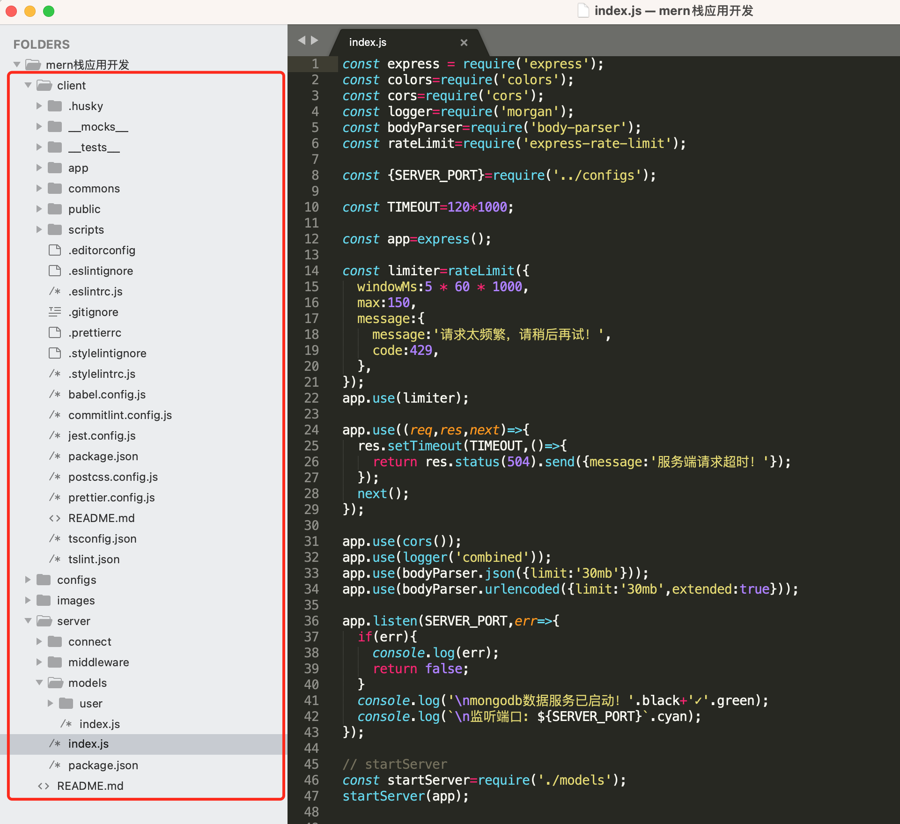
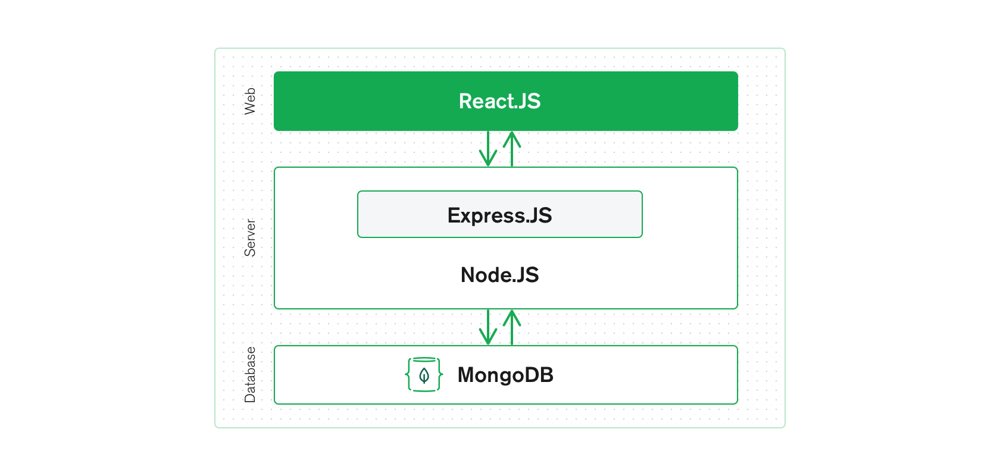
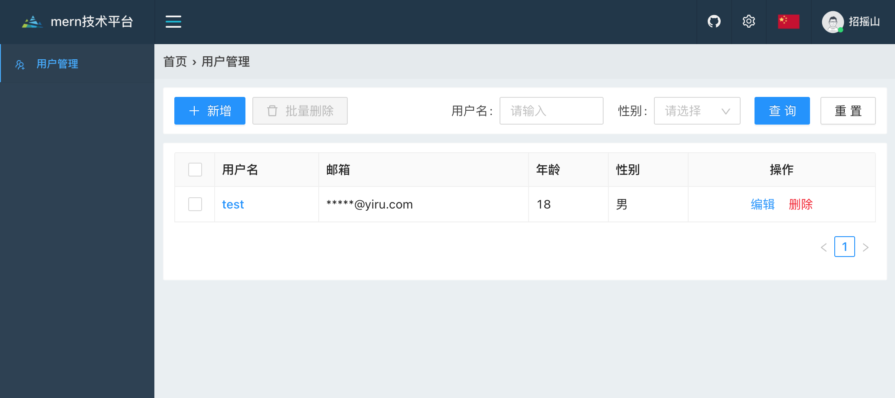

## mern栈项目开发


### mern是什么

MEAN(MongoDB、Express、React、Node.js)技术栈是专门针 对 SPA 和 NoSQL 热潮而发展起来的早期开源技术栈之一。MEAN 技 术栈中的 React 是 一个用来构建用户界面的 JavaScript 库。MongoDB 是一个流行的数据 存储 NoSQL 数据库。Node.js 是一个服务器端 JavaScript 运行环境，而 Express 是一个构建于 Node.js 之上的 Web 服务器。

### 为何使用mern技术栈


mern技术栈最棒的地方就是它全部使用的是同一个语言。无论在后端还是前端，都使用 JavaScript。所以你只需熟悉一种语言，便可在客户端和服务器之间轻松切换，就可以高效开发一个完整的web应用。

## mern技术栈开发示例

[项目代码](https://github.com/ahyiru/mern)

### 项目目录



### mongoose

连接mongodb

```javascript
const connectDB=(MONGO_URL,dataOpts=defaultOpts)=>{
  const createDB=mongoose.createConnection(MONGO_URL,dataOpts);
  createDB.on('error',err=>{
    console.log(`数据库[${MONGO_URL}]连接失败！`.red);
  });
  createDB.once('open',res=>{
    console.log(`数据库[${MONGO_URL}]连接成功！`.green);
  });
  return createDB;
};

```

创建model

```javascript
const schemas={
  name: { type: String, required: true, unique: true, index: true, trim: true },
  email: { type: String, required: true },
  password: { type: String },
  age: { type: Number },
  sex: { type: String },
};
const dataSchema=new mongoose.Schema(schemas);

const createModel=({modelName,dataSchema})=>connectModel.model(modelName,dataSchema);

```

编写服务

```javascript
const listUser=(db,req,res)=>{
  db.find((error,result)=>{
    if(error){
      return res.status(res.statusCode).send({error});
    }
    return res.status(200).send({result});
  });
};
const addUser=(db,req,res)=>{
  const {body}=req;
  const user=new db(body);
  user.save((error,result)=>{
    if(error){
      return res.status(500).send({error});
    }
    return res.status(200).send({message:'添加成功！'});
  });
};
const editUser=(db,req,res)=>{
  const {body}=req;
  db.updateOne({_id:body._id},{$set:body},error=>{
    if(error){
      return res.status(500).send({error});
    }
    return res.status(res.statusCode).send({message:'更新成功！'});
  });
};
const deleteUser=(db,req,res)=>{
  const {body}=req;
  db.deleteOne({
    _id:body.ids[0],
  },error=>{
    if(error){
      return res.status(500).send({error});
    }
    return res.status(res.statusCode).send({message:'删除成功！'});
  });
};

module.exports={
  listUser,
  addUser,
  editUser,
  deleteUser,
};

```

中间件

```javascript
const middlewareDemo=(req,res,next)=>{
  console.log(req.originalUrl);
  next();
};

```

### nodejs/express



启动服务

```javascript
const express = require('express');
const colors=require('colors');
const cors=require('cors');
const logger=require('morgan');
const bodyParser=require('body-parser');
const rateLimit=require('express-rate-limit');

const {SERVER_PORT}=require('../configs');

const TIMEOUT=120*1000;

const app=express();

const limiter=rateLimit({
  windowMs:5 * 60 * 1000,
  max:150,
  message:{
    message:'请求太频繁，请稍后再试！',
    code:429,
  },
});
app.use(limiter);

app.use((req,res,next)=>{
  res.setTimeout(TIMEOUT,()=>{
    return res.status(504).send({message:'服务端请求超时！'});
  });
  next();
});

app.use(cors());
app.use(logger('combined'));
app.use(bodyParser.json({limit:'30mb'}));
app.use(bodyParser.urlencoded({limit:'30mb',extended:true}));

app.listen(SERVER_PORT,err=>{
  if(err){
    console.log(err);
    return false;
  }
  console.log('\nmongodb数据服务已启动！'.black+'✓'.green);
  console.log(`\n监听端口: ${SERVER_PORT}`.cyan);
});

// startServer
const startServer=require('./models');
startServer(app);

```

### 配置文件

#### 1. 通用配置

```javascript
const app={
  HOST:process.env.IP||'localhost',
  PORT:process.env.PORT||8080,
  PRO_PORT:process.env.PRO_PORT||8081,
  BUILD_DIR:'../build',
  PUBLIC_DIR:'../public',
  MONGO_URL:'mongodb://localhost:27017/mern',
  PROXY_URL:'http://localhost:8888',
  SERVER_PORT:8888,
};

```

#### 2. api同构

```javascript
const apis={
  listUser:{
    url:'/user/list',
  },
  addUser:{
    url:'/user/add',
    method:'post',
  },
  editUser:{
    url:'/user/edit',
    method:'post',
  },
  deleteUser:{
    url:'/user/delete',
    method:'post',
  },
};

module.exports=apis;

```

这里的配置文件和API，前后端通用的。

### react

#### 1. webpack工程化

集成有：

- eslint、stylelint代码规范
- jest单元测试
- husky代码提交校验
- proxy代理

#### 2. 通用工具

例如：接口请求fetch函数

```javascript
const handler=response=>{
  return response.json().then(result=>{
    result.code=result.code??response.status;
    result.msg=result.message??result.msg??response.statusText;
    const {msg,code}=result;
    if(code===401){
      message.error(msg);
      // logout(true);
      throw {code,message:msg};
    }
    if(!success_code.includes(code)){
      throw {code,message:msg};
    }
    return result;
  }).catch(error=>{
    message.error(error.message);
    throw error.message;
  });
};

const fetchApi=fetcher(handler);

const fetch=({method,url,...opt})=>fetchApi(method)(`${target}${url}`,opt);

```

配合通用配置文件的apis，即可生成请求函数。

```javascript
import fetcher from './fetcher';
const apis=require('../../../configs/apis');

const {
  listUser,
  addUser,
  editUser,
  deleteUser,
}=apis;

export const listUserFn=params=>fetcher({...listUser,params});
export const addUserFn=data=>fetcher({...addUser,data});
export const editUserFn=data=>fetcher({...editUser,data});
export const deleteUserFn=data=>fetcher({...deleteUser,data});

```

#### 3. 路由管理、权限管理、i18n、鉴权等

#### 4. 业务示例



用户增删改查页面

```javascript
const Index=props=>{
  const [result,update]=useFetchList(listUserFn);
  const handleEdit=item=>{
    props.router.push({
      path:`./edit/${item._id}`,
      state:item,
    });
  };
  const handleAdd=async ()=>{
    props.router.push(`./add`);
  };
  const handleDelete=item=>{
    const items=item?[item]:selectedRows;
    const ids=items.map(v=>v._id);
    Modal.confirm({
      title: '确定删除吗？',
      icon: <ExclamationCircleOutlined />,
      content: `name: ${items.map(v=>v.name)}`,
      okText: '删除',
      okType: 'danger',
      cancelText: '取消',
      onOk:async ()=>{
        const {code,message:msg}=await deleteUserFn({ids});
        if(code===200){
          message.success(msg);
          setSelectedRows([]);
          update({current:1});
        }
      },
      onCancel(){
        console.log('Cancel');
      },
    });
  };

  const actions={
    handleCheck,
    handleEdit,
    handleDelete,
  };

  const columns=getColumns(actions);

  const {isPending,data}=result;

  return <Row>
    <Col>
      <Panel>
        <div style={{float:'left'}}>
          <Space size="small">
            <Button loading={isPending} onClick={()=>handleAdd()} type="primary" icon={<PlusOutlined />}>新增</Button>
            <Button loading={isPending} disabled={!selectedRows.length} onClick={()=>handleDelete()} icon={<DeleteOutlined />}>批量删除</Button>
          </Space>
        </div>
        <div style={{float:'right'}}>
          <SearchForm /* submit={searchList} */ loading={isPending} />
        </div>
      </Panel>
    </Col>
    <Col>
      <Panel>
        <Table
          // pagination={pagination}
          rowSelection={rowSelection}
          columns={columns}
          dataSource={data??[]}
          loading={isPending}
          size="small"
          bordered
          rowKey="_id"
        />
      </Panel>
    </Col>
  </Row>;
};

```


